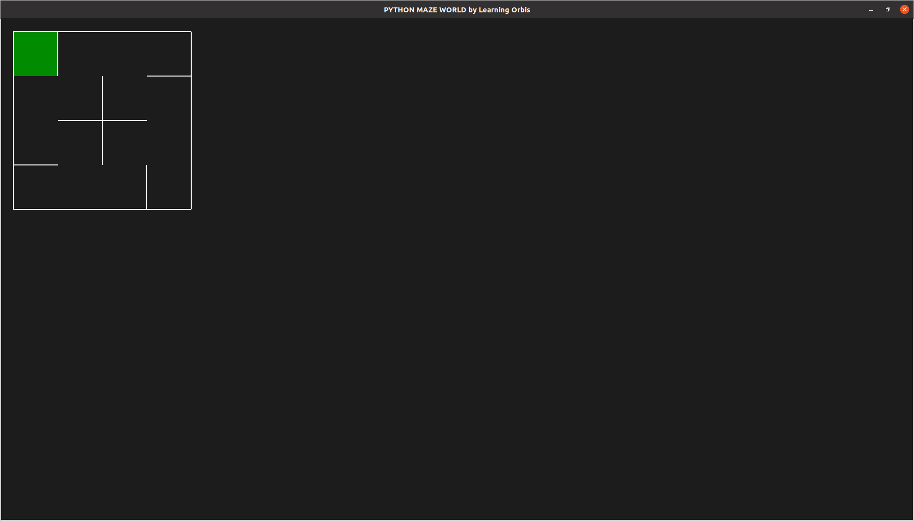
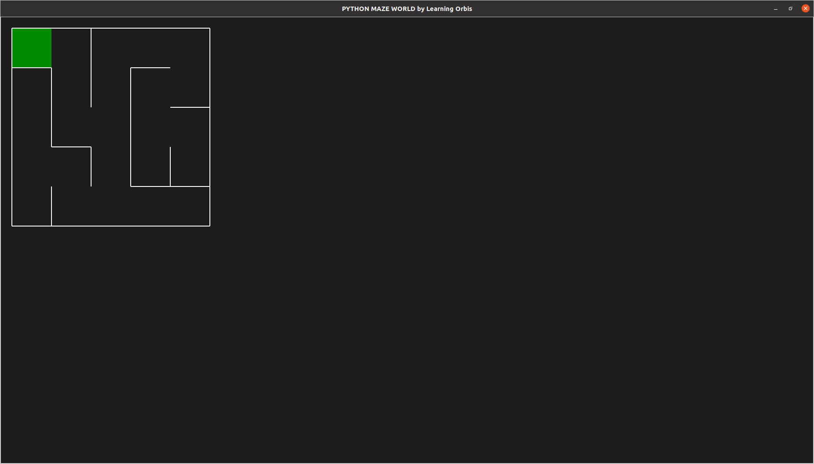

# Project1_Maze_Generation ECE 3432

## Requirements
Install [Pyamaze](https://github.com/MAN1986/pyamaze)

```
git clone https://github.com/MAN1986/pyamaze.git ./
pip3 install pyamaze
```

Clone this repo
```
git clone https://github.com/JonathanI19/Project1_Maze_Generation.git ./
```

## Basic Information
This repo is designed to convert a text or csv file into the proper format to be read by pyamaze.
Upon parsing and converting the file, pyamaze can be used to generate and save a maze based upon the data you passed in.


## Example 1 Usage

Example 1 takes in a set of input data already in the proper order (E,W,N,S), generates an output csv, and then uses this to create a static maze via Pyamaze. You do not need to pass in E,W,N,S as the default ordering assumes an E,W,N,S input file.

### Imports and Globals
Make sure to pass the path to Project1_Maze_Generation when importing modules.
```
import sys
sys.path.append("<Path to Project1_Maze_Generation>")
from parser_script import ParseFile
from pyamaze import maze

OUTPUT="<Output file name>.csv"
INPUT="<Input file name>.txt"
```

### Main Function
The ParseFile class generates an output file under the name specified by OUTPUT. This is then used to generate the maze shown below.
```
def main():
    parse = ParseFile(input_file=INPUT, output_file=OUTPUT)
    m = maze(rows=parse.rows, cols=parse.cols)
    m.CreateMaze(loadMaze=OUTPUT)
    m.run()
```



## Example 2 Usage

Example 2 takes in a set of input data that is out of order (N,S,E,W),generates an output csv, and then uses this to create a static maze via Pyamaze.

### Imports and Globals
Make sure to pass the path to Project1_Maze_Generation when importing modules.
```
import sys
sys.path.append("<Path to Project1_Maze_Generation>")
from parser_script import ParseFile
from pyamaze import maze

OUTPUT="<Output file name>.csv"
INPUT="<Input file name>.txt"
```

### Main Function
```
def main():
    parse = ParseFile(input_file=INPUT, output_file=OUTPUT,N=0, S=1, E=2, W=3)
    m = maze(rows=parse.rows, cols=parse.cols)
    m.CreateMaze(loadMaze=OUTPUT)
    m.run()
```
The ParseFile class generates an output file under the name specified by OUTPUT. This is then used to generate the maze shown below. Note how N,E,S,W are passed into ParseFile. These are indexed from 0-3 and correspond to the order of N,E,S,W in the input file.

So if your input data is ordered (S,W,E,N) you would call ParseFile the following way:
```
parse = ParseFile(input_file=INPUT, output_file=OUTPUT, N=3, S=0, E=2, W=1)
```



